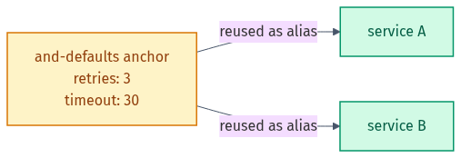

# Part 3 — Write DevOps Configs

*Anchors and aliases let you define a block once and reuse it:*

<picture><source media="(prefers-color-scheme: dark)" srcset="../docs/03-anchors-aliases-dark.png"></picture>

## 🎯 Goal
Put your YAML to work by writing the three configs you meet most: a **Kubernetes Deployment**, a **GitHub Actions workflow**, and a **Docker Compose file** — each from a written spec.

## 🧠 What you practise here
- Turning requirements into correct, nested YAML
- The shape of three real-world config formats
- Validating your file before you ever apply it

---

## 📝 The 3 exercises

| # | File | You write |
|---|------|-----------|
| 1 | `exercise-1-k8s-deployment.md`  | a Kubernetes Deployment |
| 2 | `exercise-2-github-actions.md`  | a GitHub Actions CI workflow |
| 3 | `exercise-3-docker-compose.md`  | a Docker Compose file |

For each one:

1. Read the spec in the `exercise-*.md` file.
2. Create your own YAML file and write the config.
3. Validate it: `python check.py your-file.yaml` — fix until it says `[VALID]`.
4. Compare with the matching file in [`solutions/`](solutions).

> ℹ️ `check.py` confirms the YAML is **syntactically valid**. It does not check the config against the tool's schema — for that you would use `kubectl apply --dry-run=client`, `actionlint`, or `docker compose config`. Those make great next steps once your YAML parses.

🎉 Finished all three parts? You can now read, fix, and write the YAML that runs modern infrastructure. Go back to the [main README](../README.md) and share your fork on LinkedIn!

---

## ⭐ Found this useful?
Please **star** ⭐, **fork** 🍴, and **share** 🔗 this repo on LinkedIn so others can use it too. Want to add an exercise or fix something? See [CONTRIBUTING.md](../CONTRIBUTING.md).

Made by **Shubham Sharma** · [GitHub](https://github.com/shubhs248) · [LinkedIn](https://www.linkedin.com/in/shubhs248)
