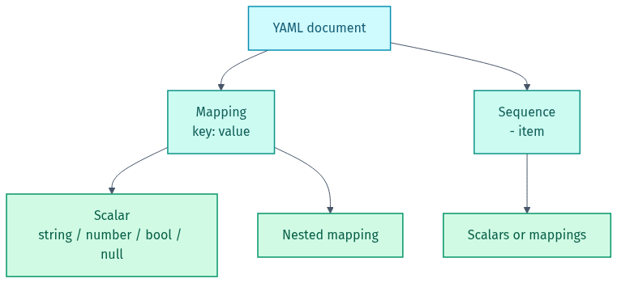
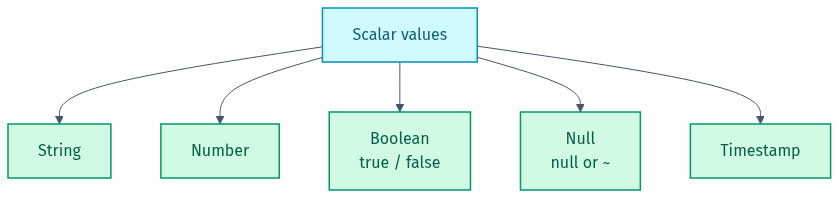

# 🖼️ Diagram Gallery — YAML

Rendered diagrams for this lab in **light + dark**. They adapt to your GitHub theme below; grab the files directly for slides or LinkedIn.

- Light: `NN-name.png` / `.svg` · Dark: `NN-name-dark.png` / `.svg`
- Editable Mermaid source lives in [`src/`](src). Re-render from the repo root with `render-diagrams.ps1`.

## 🎨 Colour legend
| Colour | Means |
|--------|-------|
| 🔵 Cyan | document root |
| 🟢 Teal / Green | structure & values |
| 🟠 Amber | reusable anchor |

---

### YAML structure
A YAML file is mappings, sequences, and scalars, nested by indentation.

<picture><source media="(prefers-color-scheme: dark)" srcset="01-yaml-structure-dark.png"></picture>

### YAML scalar data types
<picture><source media="(prefers-color-scheme: dark)" srcset="02-data-types-dark.png"></picture>

### Anchors and aliases (reuse)
<picture><source media="(prefers-color-scheme: dark)" srcset="03-anchors-aliases-dark.png"></picture>

---

Made by **Shubham Sharma** · [GitHub](https://github.com/shubhs248) · [LinkedIn](https://www.linkedin.com/in/shubhs248)
